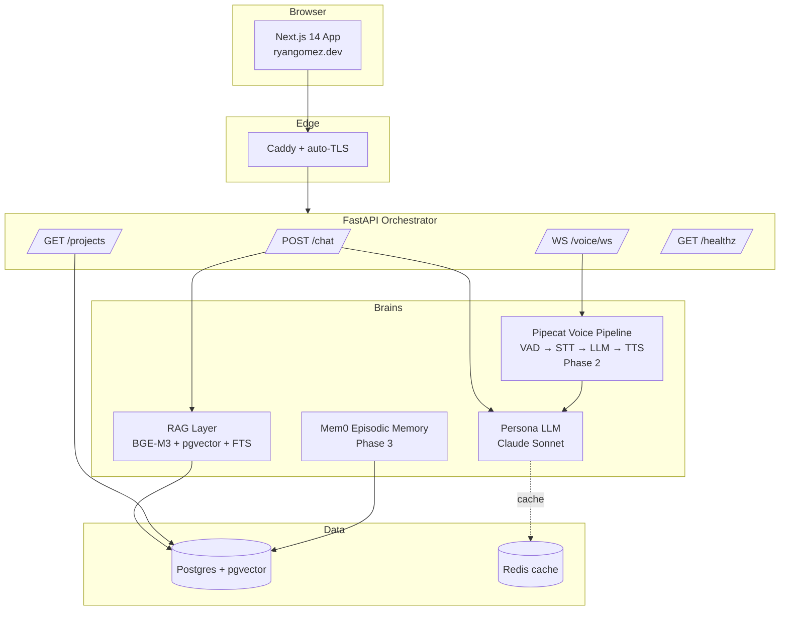

# ryan.ai — Digital Clone of Ryan Gomez

Production-grade, real-time, RAG-grounded clone of Ryan Gomez.

A single dark, cinematic web page where visitors talk to Ryan — by text or
voice — and get answers in his voice, grounded on a private knowledge base of
his projects, decisions, and writing.

> Live: [ryangomez.dev](https://ryangomez.dev)
> GitHub: [Ryan-gomezzz](https://github.com/Ryan-gomezzz)

---

## What this is

The clone behind `ryangomez.dev`. Phase 1 ships RAG-grounded text chat. Phase 2
adds voice. Phase 3 adds episodic memory and analytics. Phase 4 (optional) adds
an audio-driven lipsync avatar.

It is **not** a generic ChatGPT wrapper. The persona LLM is Claude Sonnet, but
every reply is grounded on a curated corpus, the prose style is locked to Ryan's
voice via a strict persona prompt, and hallucinated facts about employers /
projects / accomplishments are explicitly forbidden.

---

## Architecture



**Architectural commitments** (same philosophy as SOYL AI Hotel PMS):

- Native data layer. The LLM never writes to the DB directly — every state
  mutation routes through a typed FastAPI handler.
- Strict module boundaries. The retriever doesn't touch the persona LLM;
  the persona LLM doesn't touch the database; the voice pipeline reuses the
  exact same retrieval path as the text chat (single source of truth for
  what "Ryan" sounds like).
- Cost-conscious by default. Hetzner CX23 over Railway, BGE-M3 self-hosted
  over OpenAI embeddings, pgvector over a managed vector DB.

---

## Tech stack

**Frontend (`/web`)** — Next.js 14 App Router · TypeScript · Tailwind +
CSS variables · Framer Motion · GSAP + ScrollTrigger · Lenis · React Three
Fiber + drei · Zustand · TanStack Query · Vercel AI SDK · react-markdown /
remark-gfm / rehype-highlight · Lucide · Sonner · wavesurfer.js.

**Backend (`/api`)** — Python 3.11 · FastAPI + Uvicorn/Gunicorn · Pydantic v2
· LangGraph · pgvector + psycopg async pool · Redis · sentence-transformers
(BGE-M3) · Anthropic SDK · structlog · prometheus-client · Sentry · Pipecat
+ Deepgram + ElevenLabs + silero-vad (Phase 2) · mem0ai (Phase 3).

**Infra** — Docker + Compose · Caddy auto-TLS · Hetzner CX23 · GitHub Actions
CI/CD · pg_dump → Hetzner Storage Box backups.

---

## Local dev

### Prereqs

- Docker + Compose
- Python 3.11 + `pip install -e api/.[dev]`
- Node 20 + `npm install --legacy-peer-deps` in `web/`

### One-time setup

```bash
cp .env.example .env
# fill in ANTHROPIC_API_KEY at minimum
```

### Boot

```bash
# 1. data plane (Postgres + Redis)
docker compose -f infra/docker-compose.dev.yml up -d

# 2. ingest knowledge base
cd api && python -m app.rag.ingest

# 3. run API (separate terminal)
cd api && uvicorn app.main:app --reload --port 8000

# 4. run web (separate terminal)
cd web && npm run dev
```

Open [http://localhost:3000](http://localhost:3000).

### Full-stack docker (mirrors prod)

```bash
docker compose -f infra/docker-compose.yml up --build
```

---

## Knowledge base

Lives at [`api/app/data/knowledge/`](api/app/data/knowledge/). Markdown files
with optional YAML frontmatter (`title`, `type`, `priority`, `status`).

To add a new project, drop a `.md` file under `projects/`, then re-run:

```bash
cd api && python -m app.rag.ingest
```

The ingest is idempotent — it upserts on `(doc_id, chunk_index)`.

---

## Deploy

```bash
# On a fresh Hetzner CX23 (Ubuntu 24.04):
scp infra/hetzner-deploy.sh .env root@your-box:/tmp/
ssh root@your-box 'bash /tmp/hetzner-deploy.sh'
```

Point `ryangomez.dev` and `api.ryangomez.dev` at the box's IP, then Caddy
auto-issues TLS on first connection.

CI/CD is wired in [`infra/github-actions/ci.yml`](infra/github-actions/ci.yml)
— move it to `.github/workflows/` and add `HETZNER_HOST`, `HETZNER_USER`,
`HETZNER_SSH_KEY` to repo secrets.

---

## Cost targets

| Component         | Idle                  | Per conversation              |
| ----------------- | --------------------- | ----------------------------- |
| Hetzner CX23      | ~$5–7/mo              | n/a                           |
| Postgres + Redis  | self-hosted, included | n/a                           |
| Claude API        | $0                    | ~$0.005 (5 turns, RAG cached) |
| Deepgram STT      | $0                    | ~$0.012 (3 min @ Nova-3)      |
| ElevenLabs TTS    | $0                    | ~$0.030 (3 min Flash v2.5)    |
| **Voice total**   |                       | **~$0.05**                    |
| **Text total**    |                       | **~$0.005**                   |

Aggressive Redis caching on the (query_embedding, top_k_doc_ids) → response
mapping eats the steady-state load — most visitors ask near-duplicate questions
("what's SOYL", "tech stack", "how do I contact you").

---

## Acceptance checklist

- [x] Dark cinematic landing with Ryan's name and ambient R3F scene.
- [x] `/chat` streams in-character, RAG-grounded replies via SSE.
- [x] Project gallery scroll-driven with GSAP, backed by the same corpus.
- [x] Hard rules enforced in the persona prompt (no phone, no fabricated
      employers, no business commitments, jailbreak-resistant).
- [ ] `/voice` live (Phase 2 — needs ElevenLabs voice clone + keys).
- [ ] Mem0 episodic memory across sessions (Phase 3).
- [ ] Lighthouse Perf ≥ 90, A11y ≥ 95.
- [x] Costs <$0.05 per conversation, <$30/mo idle.

---

## License

MIT. Code is open. The persona, the knowledge base, and the voice clone are
not — those are Ryan's identity.
